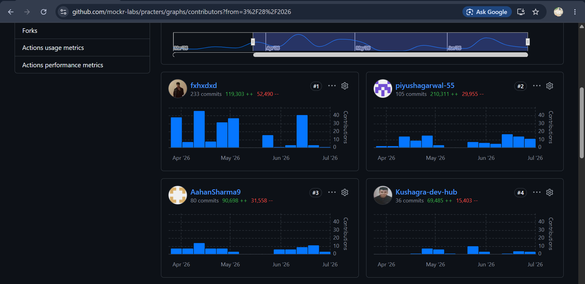
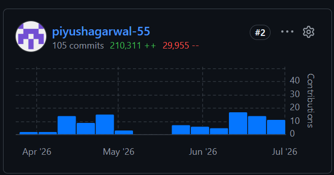
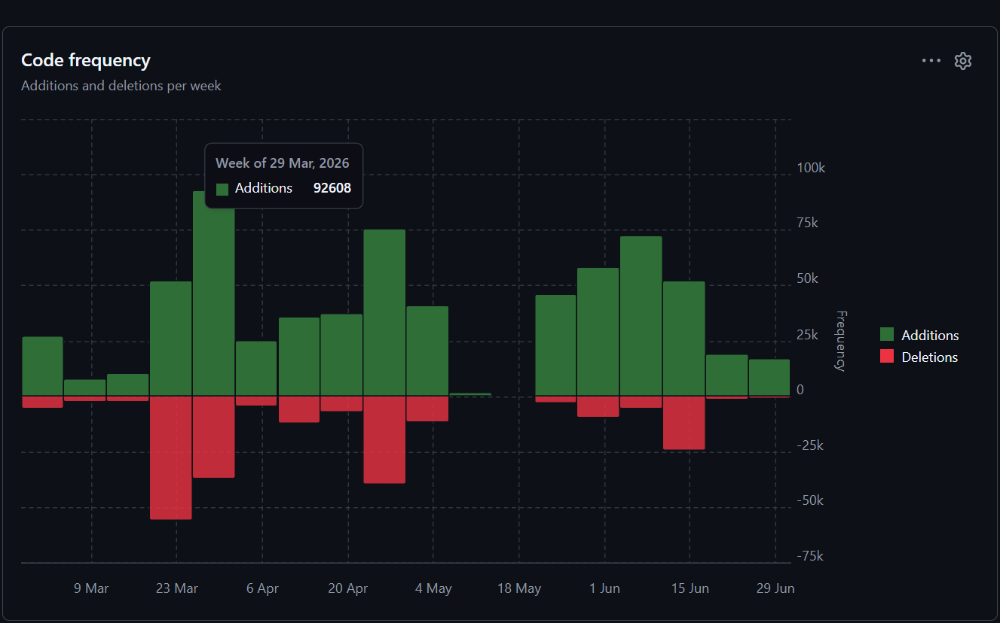
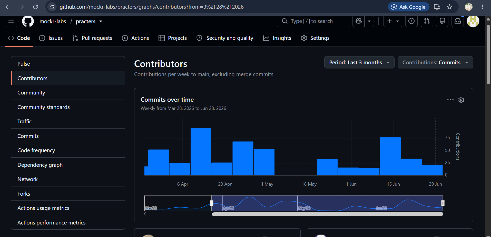

<div align="center">

# PIYUSH AGARWAL

### Full Stack Developer | CTO at Practers | AI Systems Builder


<br />

<a href="mailto:piyushaga2005@gmail.com"></a>
<a href="https://www.practers.com/"></a>
<a href="https://github.com/piyushagarwal-55"></a>

</div>

## Why Me

```javascript
const piyush = {
  role: "Chief Technology Officer at Practers",
  education: "B.Tech CCE, LNMIIT Jaipur",
  cgpa: "7.52/10",
  location: "Rupnagar, Punjab",
  work: ["AI interview systems", "contest infra", "hiring dashboards", "secure OA"],
  stack: ["Next.js 16", "React 19", "Fastify 5", "Prisma", "Supabase", "MongoDB", "Redis"],
  infra: ["Google Cloud Run", "Docker", "BullMQ", "Judge0", "Cloudflare R2"],
  coding: "740+ problems across LeetCode, Codeforces and GeeksForGeeks",
  mindset: "Build fast. Debug deeply. Ship clean."
};
```

## Current Work

<table>
<tr>
<td width="50%" valign="top">

### Practers | Chief Technology Officer

Apr 2026 to Present

Leading architecture for an AI native interview preparation and hiring platform built as a Turborepo monorepo with Next.js 16, React 19, TypeScript, Fastify 5, Prisma, Supabase, PostgreSQL, MongoDB, Redis, BullMQ and Socket.IO.

Built resume aware AI mock interviews with authenticated WebSockets, Groq voice/text sessions, Gemini/OpenAI integrations, stage orchestration, code/canvas snapshots and rubric scored reports.

Built secure coding, contest and hiring modules using Judge0, Redis/BullMQ queues, hidden tests, real time verdicts, ATS resume analysis, Monaco editor, Excalidraw scratchpads and OA proctoring.

Deployed services on Google Cloud Run with Docker, Secret Manager, Cloudflare R2 style storage, Razorpay payments, Resend email and MSG91 verification.

<a href="https://www.practers.com/">Live product</a>

</td>
<td width="50%" valign="top">

### A1 Selectors | Software Developer Intern

Aug 2025 to Dec 2025

Built scalable REST APIs for automated resume parsing using NLP based extraction, reducing manual screening effort by 35 percent across recruiter workflows.

Developed AI recruitment workflows for candidate matching, ranking, scheduling automation, filtering, analytics and recruiter decision support.

Implemented backend analytics for parsing accuracy, shortlist quality, recruiter activity and candidate pipeline movement.

</td>
</tr>
</table>

## Practers Architecture

<table width="100%">
<tr>
<td align="center" width="25%">
<h3>Product Apps</h3>
<p>Next.js 16, React 19, Tailwind 4, Monaco editor, Excalidraw, TipTap, React Query</p>
</td>
<td align="center" width="25%">
<h3>API Layer</h3>
<p>Fastify 5, TypeScript, Prisma, Supabase auth, Socket.IO, REST APIs, Zod validation</p>
</td>
<td align="center" width="25%">
<h3>Execution Infra</h3>
<p>Judge0, BullMQ, Redis, hidden tests, scoring service, contest service, code workers</p>
</td>
<td align="center" width="25%">
<h3>Platform Infra</h3>
<p>Google Cloud Run, Docker, Cloud Build, Secret Manager, Cloudflare R2, Vercel</p>
</td>
</tr>
<tr>
<td align="center" colspan="2">
<h3>AI and Interview Runtime</h3>
<p>Groq, Gemini, OpenAI, Deepgram, resume parsing, voice/text sessions, stage based interview orchestration</p>
</td>
<td align="center" colspan="2">
<h3>Hiring and Proctoring</h3>
<p>Company dashboard, secure OA, MediaPipe, TensorFlow.js, webcam checks, Razorpay, Resend and MSG91</p>
</td>
</tr>
</table>

## Practers Contribution Proof

<div align="center">

Verified from the private <b>mockr-labs/practers</b> repository insights. Across a large, multi developer, high infrastructure codebase, I authored the highest volume of code on the team.

</div>

<table width="100%">
<tr>
<td align="center" width="25%">
<h3>Rank</h3>
<h2>#2</h2>
<p>contributor by commits</p>
</td>
<td align="center" width="25%">
<h3>Lines Added</h3>
<h2>210,311</h2>
<p>most on the team</p>
</td>
<td align="center" width="25%">
<h3>Commits</h3>
<h2>105</h2>
<p>to main branch</p>
</td>
<td align="center" width="25%">
<h3>Peak Week</h3>
<h2>92,608</h2>
<p>additions in one week</p>
</td>
</tr>
</table>

<table width="100%">
<tr>
<td align="center" width="50%" valign="top">
<h3>Contributor Leaderboard</h3>
<p>Ranked #2 by commits with 210,311 additions, the highest line count of any contributor.</p>

</td>
<td align="center" width="50%" valign="top">
<h3>My Contributor Card</h3>
<p>105 commits, 210,311 additions and 29,955 deletions to the Practers codebase.</p>

</td>
</tr>
<tr>
<td align="center" width="50%" valign="top">
<h3>Code Frequency</h3>
<p>Weekly additions and deletions, peaking at 92,608 additions in a single week.</p>

</td>
<td align="center" width="50%" valign="top">
<h3>Commits Over Time</h3>
<p>Sustained weekly contribution to the main branch of a production, multi service platform.</p>

</td>
</tr>
</table>

## Tech Stack

<div align="center">

### Languages


### Frontend


### Backend


### Database and Infrastructure


<br />
<br />


</div>

## Education

<table>
<tr>
<td width="50%" valign="top">

### The LNM Institute of Information Technology

B.Tech in Communication and Computer Engineering

2024 to Expected 2028

CGPA: **7.52/10**

Jaipur, Rajasthan

</td>
<td width="50%" valign="top">

### Coursework and Core Areas

Data Structures and Algorithms, Object Oriented Programming, DBMS, Operating Systems, Computer Networks, System Design, LLMs, AWS Bedrock and Multi Agent Systems.

</td>
</tr>
</table>

## Live Projects

<table>
<tr>
<td width="50%" valign="top">

### [Practers](https://www.practers.com/)

AI native interview preparation and hiring platform with resume aware mock interviews, peer interviews, coding rounds, contests, secure OA, ATS analysis, proctoring and company hiring dashboards.

**Stack:** Next.js 16, React 19, TypeScript, Fastify 5, Prisma, Supabase, PostgreSQL, MongoDB, Redis, BullMQ, Socket.IO, Judge0

**Infra:** Google Cloud Run, Docker, Cloud Build, Cloudflare R2, Vercel, Razorpay, Resend, MSG91

**Links:** [Live](https://www.practers.com/)

</td>
<td width="50%" valign="top">

### [Sheet AI Pro](https://github.com/piyushagarwal-55/sheet-ai-pro)

Real time collaborative spreadsheet with Operational Transformation over WebSockets, persistent multi user state and reconnect safe synchronization.

**Stack:** Next.js, Node.js, WebSockets, PostgreSQL

**Proof:** under 100ms recalculation across 2,500+ cells

</td>
</tr>
<tr>
<td width="50%" valign="top">

### [ShopSage](https://github.com/piyushagarwal-55/hackathon-we-make-devs)

AI shopping assistant using AWS Bedrock and Llama 3 for search, recommendations, personalization, budget flows and generative UI.

**Stack:** Next.js, FastAPI, MongoDB, AWS Bedrock, Llama 3

**Links:** [Live](https://hackathon-we-make-devs.vercel.app/) | [Demo](https://youtu.be/2icL9ZYp3SY?si=GYkttEaxtOI2zbV1)

</td>
<td width="50%" valign="top">

### [Nexus Flow](https://nexusflowbeta.vercel.app/)

Web3 full stack project built around blockchain product UX and SKALE Network integration.

**Stack:** Web3, SKALE Network, Full Stack

**Links:** [Live](https://nexusflowbeta.vercel.app/) | [Demo](https://youtu.be/S1DNJXRR7LI?si=GoA0i85SfAU4o5gC)

</td>
</tr>
<tr>
<td width="50%" valign="top">

### [RepVote](https://repvote-v1.vercel.app/)

Decentralized voting and prediction style polling with smart contracts deployed on Arbitrum Sepolia.

**Stack:** TypeScript, Solidity, Arbitrum, Web3

**Links:** [Live](https://repvote-v1.vercel.app/) | [Repo](https://github.com/piyushagarwal-55/hackathon-main)

</td>
<td width="50%" valign="top">

### [LNMIIT Carpool App](https://github.com/piyushagarwal-55/carpool-lnmiit-work)

Ride sharing app for 100+ students with ride creation, seat booking, approvals, group chat and location based coordination.

**Stack:** React Native, TypeScript, Supabase, Socket.IO

**Links:** [APK](https://github.com/piyushagarwal-55/carpool-lnmiit-work/releases/download/v1.0.0/LNMIIT.Carpool.apk)

</td>
</tr>
</table>

## Video Proof

<table width="100%">
<tr>

<td align="center" width="25%">
<h3>FlowForge</h3>
<p>Generative UI backend builder</p>
<a href="https://youtu.be/VcgeOuzxbdg?si=QHoUZsFBWw5Hm0vV">

</a>
</td>
<td align="center" width="25%">
<h3>ShopSage</h3>
<p>Tambo hackathon project demo</p>
<a href="https://youtu.be/2icL9ZYp3SY?si=GYkttEaxtOI2zbV1">

</a>
</td>
<td align="center" width="25%">
<h3>Nexus Flow</h3>
<p>SKALE Network project demo</p>
<a href="https://youtu.be/S1DNJXRR7LI?si=GoA0i85SfAU4o5gC">

</a>
</td>
</tr>
</table>

## More Live Links

<div align="center">

<a href="https://gamma-ai-watermark-remover.vercel.app/"></a>
<a href="https://pridiction-market-frontend-nfrj.vercel.app/"></a>

<a href="https://youtu.be/VcgeOuzxbdg?si=QHoUZsFBWw5Hm0vV"></a>


</div>

## Achievements

<table width="100%">
<tr>
<td align="center" width="25%">
<h3>LeetCode</h3>
<h2>320+</h2>
<p>questions solved</p>
</td>
<td align="center" width="25%">
<h3>Codeforces</h3>
<h2>220+</h2>
<p>questions solved</p>
</td>
<td align="center" width="25%">
<h3>GeeksForGeeks</h3>
<h2>200+</h2>
<p>questions solved</p>
</td>
<td align="center" width="25%">
<h3>CGPA</h3>
<h2>7.52/10</h2>
<p>LNMIIT</p>
</td>
</tr>
<tr>
<td align="center" colspan="2">
<h3>Google Big Code Hackathon 2026</h3>
<p>Cleared 3 competitive coding rounds</p>
</td>
<td align="center">
<h3>Unstoppable Hackathon</h3>
<p>Top 10 team</p>
</td>
<td align="center">
<h3>AI for Bharat AWS</h3>
<p>Top 300 teams</p>
</td>
</tr>
</table>

## Coding Profiles

<table width="100%">
<tr>
<td align="center" width="33%">
<a href="https://leetcode.com/u/piyushagarwal-55/">

</a>
<br />
<br />
<a href="https://leetcode.com/u/piyushagarwal_55/">View profile</a>
</td>
<td align="center" width="33%">
<a href="https://codeforces.com/profile/piyushagarwal_5">

</a>
<br />
<br />
<a href="https://codeforces.com/profile/piyushagarwal-5">View profile</a>
</td>
<td align="center" width="33%">
<a href="https://www.geeksforgeeks.org/profile/piyushagarwal_55?tab=activity">

</a>
<br />
<br />
<a href="https://www.geeksforgeeks.org/user/piyushagarwal-55">View profile</a>
</td>
</tr>
</table>

## GitHub Analytics

<div align="center">


</div>

## Contribution Graph

<div align="center">

<picture>
  <source media="(prefers-color-scheme: dark)" srcset="https://raw.githubusercontent.com/piyushagarwal-55/piyushagarwal-55/output/github-contribution-grid-snake-dark.svg">
  <source media="(prefers-color-scheme: light)" srcset="https://raw.githubusercontent.com/piyushagarwal-55/piyushagarwal-55/output/github-contribution-grid-snake.svg">
  
</picture>

<br />
<br />


</div>
