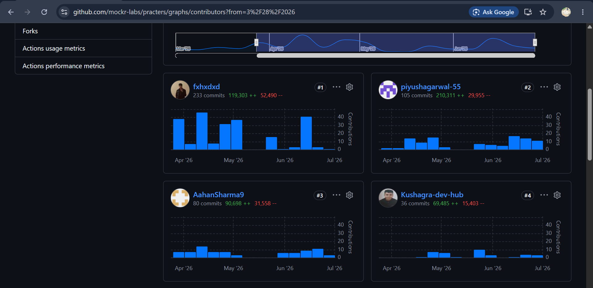

 

---

## The 30 second version

### The agent does not have taste. Either I do, or nobody on that surface does.

Pre-final year CS student. Already took a product from **zero to 1000+ users** and built the tooling underneath it.

I do not write prompts and hope.

I build **the harness that catches an agent being confidently wrong**, because that is what decides whether a surface ships or embarrasses me.

I run **several plans in parallel** with Claude Code, custom skills and parallel subagents.

I have opinions about **which model gets which job**, and I did not get them from a blog post.

I ship agents that **spend real money unsupervised**, and agents that **act on their own without being asked**. That is a fast way to learn exactly where these systems fail, and to build the habit of catching it.

On mobile I ship **React Native and Expo to production**, with **live push** and **row-level security**, in a **CI/CD pipeline with automated tests**.

      

---

## Agent tooling, the part most people skip

**Anyone can get a demo working.**
**The hard part is knowing in ten seconds that an agent has confidently produced garbage.**

Here is what I built so that I would know.

### Self-hosted MCP servers

- **LaunchOps** exposes **13 tools** over a self-hosted MCP server, which an agent uses to provision live cloud infrastructure, databases, hosting and domains.
- **FlowForge** runs its own MCP server, exposing a node-based workflow engine as an **agent-callable tool**.
- MCP integrations across **4 separate projects**, over both HTTP and Stdio transports.

   

### LLM-as-judge eval harnesses

- Every Practers interview is scored by **parallel specialised judge models**, combined by an orchestrator into a **rubric-grounded verdict**.
- Judge-to-human agreement is **measured on a golden set**, and where judges disagree the case **auto-escalates to a human** instead of being silently scored.
- The whole suite runs **in CI, so a bad prompt change fails the build** exactly like a unit test.

   

### Guardrails enforced outside the model

- In **Pounce** an agent completes real purchases with **nobody watching when money moves**, so the cap sits **inside the payment mandate where the bank enforces it**, not in my code and not in a prompt. A fully compromised agent still cannot exceed it.
- Deterministic state machine with the **model advisory only**, plus idempotency keys on every attempt, advisory locks so two triggers cannot double-fire, and signature-verified webhooks.
- A **replayable audit trail** of every decision, so any action can be reconstructed with the state that caused it.

   

### Proactive agents, not request-response bots

- **Pounce's mandate agent** runs as a **long-lived watcher**. It holds state across days and **acts on its own** the moment a price drops.
- The hard part was never the acting, it was the **arming**: a **capped, time-bound authorization** granted once, so a watcher that fires unattended at 3am **cannot do damage**.
- That is the shape of any proactive system. Something is always running, and the real question is what it is allowed to do **when nobody is looking**.

  

### Knowing when to stay silent

- For anything proactive the failure mode is **not being wrong, it is being noisy**. A suggestion nobody asked for costs **trust**, and then the feature gets switched off.
- So the interesting engineering is **suppression, not generation**. My judge harness already behaves that way: **act on high confidence, escalate on disagreement, stay quiet otherwise**.
- I **route work by which model is genuinely good at it**, because once something runs continuously, **what it costs to run is a product decision** rather than an afterthought.

  

### How I actually work

- I run **several plans in parallel** with Claude Code, custom skills and parallel subagents, and I have opinions about **which model gets which job**.
- I write **CI guard scripts that fail a build on policy violations**, not just on failing tests. One of mine fails the build if a credential identifier appears **anywhere outside the single module allowed to hold it**.
- The rule I work by: **the model advises, deterministic code decides.**

   

---

## Shipped, with real people using it

<table>
<tr>
<td width="58%" valign="top">

### [Practers](https://practers.com/)

A **real-time AI interviewer**.

It holds a live voice conversation at **sub-second latency over WebSockets**, and **adapts its questions to the candidate's own resume** while the interview is happening.

Taken **0 to 1000+ users across 1000+ sessions**, with live health monitoring.

The hard part was never the interview. It was making the **score defensible**, which is where the judge harness came from.

  

**Stack** Next.js 16, React 19, Fastify 5, Prisma, Supabase, PostgreSQL, MongoDB, Redis, BullMQ, Socket.IO, Judge0

**Infra** Google Cloud Run, Docker, Cloud Build, Cloudflare R2, Razorpay, Resend, MSG91

</td>
<td width="42%" valign="top">

### Contribution proof

Verified from the private <b>mockr-labs/practers</b> repository insights.

   

</td>
</tr>
</table>

---

## Projects

<table>
<tr>
<td width="50%" valign="top">

### [Pounce](https://github.com/piyushagarwal-55/teampounce)

**5 role-bounded LLM agents** on a tool-calling harness, transacting with **live merchants** over MCP and Shopify UCP.

Every pick grounded on a **Senso RAG context layer**.

The **mandate agent** arms a **capped, time-bound authorization once**, then buys on its own **on a price drop**.

I shipped an **LLM-as-judge harness scoring every tool call on real merchant data**, to catch **confident-wrong actions before checkout**.

  

**Stack** OpenAI gpt-4o, MCP / Shopify UCP, Prava, Senso (RAG), Next.js, TypeScript, WebSockets

[Live](https://teampounce.vercel.app) · [Code](https://github.com/piyushagarwal-55/teampounce)

</td>
<td width="50%" valign="top">

### [LaunchOps](https://github.com/piyushagarwal-55/launchops-hackathon)

An agent that **provisions live cloud resources**, exposed as **13 tools over a self-hosted MCP server**.

Since the agent is spending and provisioning on its own, guardrails are **policy-as-code**.

A **scope, budget and approval engine** checks every action before it runs, with a **dry-run mode** and a **replayable audit trace**.

**No agent can ever exceed its granted authority.** Built with Claude Code, custom skills and parallel subagents, full stack in days.

  

**Stack** Next.js, TypeScript, MCP (HTTP and Stdio), Socket.io, Node.js

[Live](https://launchops-hackathon.vercel.app) · [Code](https://github.com/piyushagarwal-55/launchops-hackathon)

</td>
</tr>
<tr>
<td width="50%" valign="top">

### [FlowForge](https://github.com/piyushagarwal-55/flowforge)

Compiles **natural-language specs into deployable REST APIs** through an LLM tool-calling pipeline.

A node-based workflow engine handles data models, auth, validation and business logic, with an execution runtime and one-click deploy.

Its **self-hosted MCP server exposes every generated endpoint as an agent-callable tool**.

 

[Live](https://flowforge-i871.vercel.app) · [Demo](https://youtu.be/VcgeOuzxbdg) · [Code](https://github.com/piyushagarwal-55/flowforge)

</td>
<td width="50%" valign="top">

### [Sheet AI Pro](https://github.com/piyushagarwal-55/sheet-ai-pro)

Real-time collaborative spreadsheet using **Operational Transformation over WebSockets**.

Persistent multi-user state, reconnect-safe synchronisation.

**Under 100ms recalculation across 2,500+ cells.**

  

[Code](https://github.com/piyushagarwal-55/sheet-ai-pro)

</td>
</tr>
<tr>
<td width="50%" valign="top">

### [Prediction Market](https://pridiction-market-frontend-nfrj.vercel.app/)

A market where positions are priced by **what people actually believe**, not by what they say.

Building it teaches you one thing fast: **a probability only means something when someone has money on it.**

[Live](https://pridiction-market-frontend-nfrj.vercel.app/)

<!-- SWAPPR: send me these four things and I will write this card properly.
     1. one line on what it does
     2. Swift or React Native
     3. App Store link
     4. any user or download number
     They list "shipped something to the App Store yourself" as a brownie point,
     so this is worth getting right rather than guessing.
-->

</td>
<td width="50%" valign="top">

### [Sloop](https://swyclr.com) &nbsp; 

A **barter marketplace** for iPhone and Android, built at Swyft Ventures. Swipe to match items, **AI item valuation**, hybrid cash-plus-item deals, **auction rooms**, escrow, location discovery and in-app chat.

I wrote a **custom native Expo module** for Truecaller authentication, with its own Android sources, Gradle build and ProGuard rules.

I also wrote an **Expo config plugin** to fix a silent **Android 11+ package-visibility** bug: the payment SDK ships an empty manifest, so UPI apps were invisible to the checkout and **the sandbox VPA passed while production quietly failed**.

**Native** custom Expo module, config plugins, Hermes, New Architecture, Apple and Google Sign In, push
**Payments** Cashfree UPI, RevenueCat subscriptions, escrow flow
**Backend** Supabase, Express feed API, Jest and Testing Library

  

[Site](https://swyclr.com)

</td>
</tr>
<tr>
<td width="50%" valign="top">

### [ShopSage](https://github.com/piyushagarwal-55/hackathon-we-make-devs)

AI shopping assistant on **AWS Bedrock and Llama 3**.

Search, recommendations, personalisation, budget flows and generative UI.

[Live](https://hackathon-we-make-devs.vercel.app/) · [Demo](https://youtu.be/2icL9ZYp3SY)

</td>
<td width="50%" valign="top">

### [Nexus Flow](https://nexusflowbeta.vercel.app/)

Built on **SKALE Network**.

[Live](https://nexusflowbeta.vercel.app/) · [Demo](https://youtu.be/S1DNJXRR7LI)

</td>
</tr>
<tr>
<td width="50%" valign="top">

### [RepVote](https://repvote-v1.vercel.app/)

Reputation-weighted voting. [Live](https://repvote-v1.vercel.app/)

</td>
<td width="50%" valign="top">

### [LNMIIT Carpool](https://github.com/piyushagarwal-55/carpool-lnmiit-work)

A carpool app **used on my own campus**. [Code](https://github.com/piyushagarwal-55/carpool-lnmiit-work)

</td>
</tr>
</table>

---

## Experience

<table>
<tr>
<td width="50%" valign="top">

### Practers · Co-Founder and Founding Engineer
Apr 2026 to Present

Led architecture for an **AI-native interview and hiring platform** as a Turborepo monorepo.

Built **resume-aware AI mock interviews** with authenticated WebSockets, Groq voice and text sessions, Gemini and OpenAI integrations, stage orchestration and **rubric-scored reports**.

Built secure coding, contest and hiring modules on Judge0 with Redis and BullMQ queues, hidden tests, real-time verdicts, ATS analysis and OA proctoring.

Deployed on **Google Cloud Run** with Docker, Secret Manager, R2-style storage, Razorpay, Resend and MSG91.

</td>
<td width="50%" valign="top">

### Swyft Ventures · SDE 1 Intern
Jan 2026 to Jun 2026 · Gemini-focused startup · Remote

Designed and shipped a **real-time swipe-based matching engine** where mutual opt-ins **instantly create matches**.

Backed by **Supabase row-level security** and live **Expo push on React Native**.

Shipped **high-quality releases** with automated unit and integration tests in a **GitHub Actions CI/CD pipeline**, plus real-time monitoring and error tracking.

 

</td>
</tr>
<tr>
<td width="50%" valign="top">

### A1 Selectors · Software Developer Intern
Aug 2025 to Dec 2025

Built scalable REST APIs for **automated resume parsing** using NLP-based extraction.

**Cut manual screening effort by 35 percent** across recruiter workflows.

Developed AI recruitment workflows for candidate matching, ranking, scheduling automation and recruiter decision support.

</td>
<td width="50%" valign="top">

### Teaching Assistant · LNMIIT

Mentored students across **two semesters**, communicating complex ideas and presenting solutions in labs.

**B.Tech Communication and Computer Engineering**
CGPA **7.52** · Aug 2024 to Aug 2028

</td>
</tr>
</table>

---

## Open source

| Project | What I did | Why it counts |
|---|---|---|
| **[Zulip](https://github.com/zulip/zulip)** GSoC org | Onboarded into their **large-scale production Django codebase** and was assigned by a **core maintainer** to migrate message-editing banners to a modern shared component. Shipped with **passing unit tests** and a design proposal. | Code other engineers actually use, in a repo I did not control. **[PR #39811](https://github.com/zulip/zulip)** |
| **AOSSIE** GSoC org | Diagnosed and fixed a **governance-audit bug** in OrgExplorer that counted closed issues and PRs as open. | It was **inflating dashboard metrics by up to 12x**. **PR #123** |

---

## Competitive

    

<b>Google Big Code Hackathon 2026</b>: top 1% after <b>three national elimination rounds</b>.

---

## Stack

**AI and agents** &nbsp;·&nbsp; MCP &nbsp;·&nbsp; eval harnesses &nbsp;·&nbsp; LLM-as-judge &nbsp;·&nbsp; multi-agent orchestration &nbsp;·&nbsp; RAG &nbsp;·&nbsp; prompt evaluation &nbsp;·&nbsp; tool-calling

---

 

### If you are hiring someone to own a surface end to end, I am the one you point at when it breaks.

